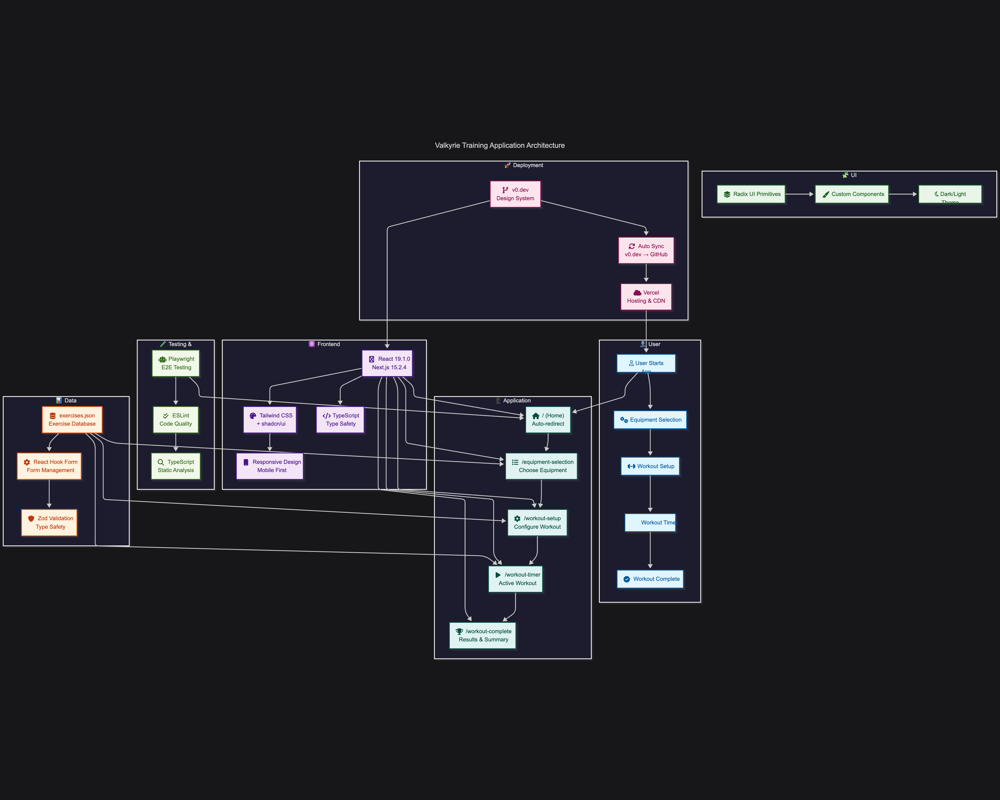
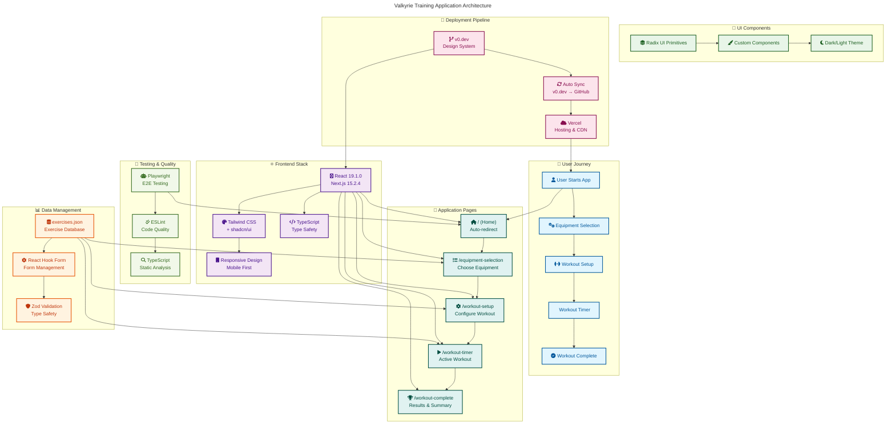

# Valkyrie Training

*Automatically synced with your [v0.dev](https://v0.dev) deployments*

[](https://vercel.com/neozeniths-projects-4e562638/v0-valkyrie-training)
[](https://v0.dev/chat/projects/1uyWUO7uL6a)

## Overview

This repository will stay in sync with your deployed chats on [v0.dev](https://v0.dev).
Any changes you make to your deployed app will be automatically pushed to this repository from [v0.dev](https://v0.dev).

## Diagrams

### PNG



### SVG


### MermaidJS



## Quickstart

```sh
pnpm dev # Start development server with hot reload
pnpm build # Build for production
pnpm start # Start production server
pnpm lint # Run ESLint
pnpm test # Run Playwright tests
```

## Browser Support

This application supports the following browsers:
- ✅ Chrome/Chromium (Desktop & Mobile)
- ✅ Firefox (Desktop)
- ❌ Safari (Not supported - see [`docs/BROWSER_SUPPORT.md`](docs/BROWSER_SUPPORT.md))

## Deployment

Your project is live at:

**[https://vercel.com/neozeniths-projects-4e562638/v0-valkyrie-training](https://vercel.com/neozeniths-projects-4e562638/v0-valkyrie-training)**

## Build your app

Continue building your app on:

**[https://v0.dev/chat/projects/1uyWUO7uL6a](https://v0.dev/chat/projects/1uyWUO7uL6a)**

## How It Works

1. Create and modify your project using [v0.dev](https://v0.dev)
2. Deploy your chats from the v0 interface
3. Changes are automatically pushed to this repository
4. Vercel deploys the latest version from this repository